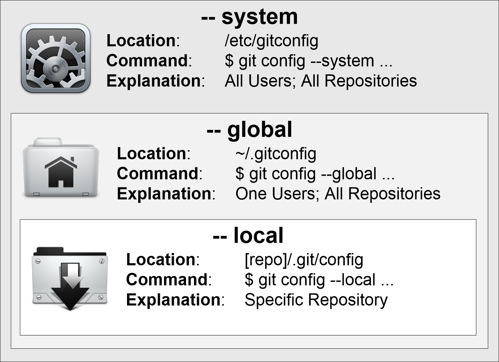

# First Time Git Setup
Git comes with a tool called git config that lets you get and set configuration variables that control all aspects of how Git looks and operates. These variables can be stored in three different places:

- `/etc/gitconfig` file: Contains values for every user on the system and all their repositories. If you pass the option `--system` to `git config`, it reads and writes from this file specifically.
- `~/.gitconfig` or `~/.config/git/config` file: Specific to your user. You can make Git read and write to this file specifically by passing the `--global` option.
- `config` file in the Git directory (that is, `.git/config`) of whatever repository you’re currently using: Specific to that single repository.

Each level overrides values in the previous level, so values in .`git/config` trump those in `/etc/gitconfig`.

**Note:** The path to git config file for each level of configuration may be slightly different on your system. To check the path to the config file for global level for example, run `git config --global --edit` and check the opened file path. The same applies for the other levels.



## Setting Your Username and Email
It’s important to set your user name and email address because every Git commit uses this information, and it’s immutably baked into the commits you start creating:

```bash
$ git config --global user.name "John Doe"
$ git config --global user.email
```

## Checking Your Settings
You can check your settings at any time by running the `git config --list` command:

```bash
$ git config --list
user.name=Ali Hejazizo
user.email=hejazizo@ualberta.ca
```

**Note:**
- Your output may include more settings than the ones shown here. The settings shown here are the only settings you need to set up to get started with Git.
- To see the config level of a specific setting, run `git config --show-origin --name-only --get-regexp <setting>`. For example, to see the config level of `user.name`, run `git config --show-origin --name-only --get-regexp user.name`.


## Setting Your Default Text Editor
If you want to use a text editor other than Vim/Nano or any other default editor you have on your system, you can set your default text editor with the `core.editor` variable. For example, to set the default text editor to VSCode, you can use:

```bash
$ git config --global core.editor "code --wait"
```

**Note:** The `--wait` or `-w` flag is crucial without this git won't know the editing has completed and in turn won't finish executing the git command.
