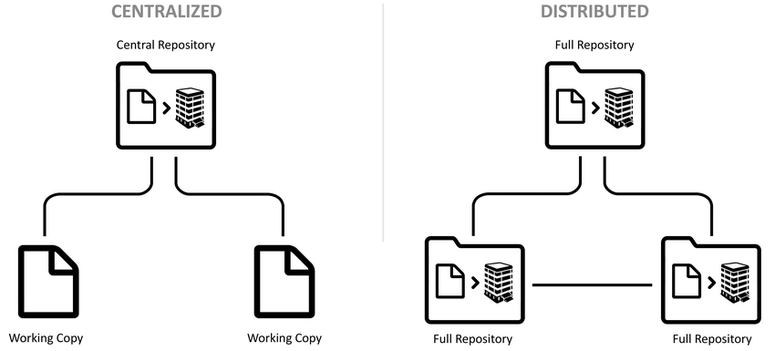
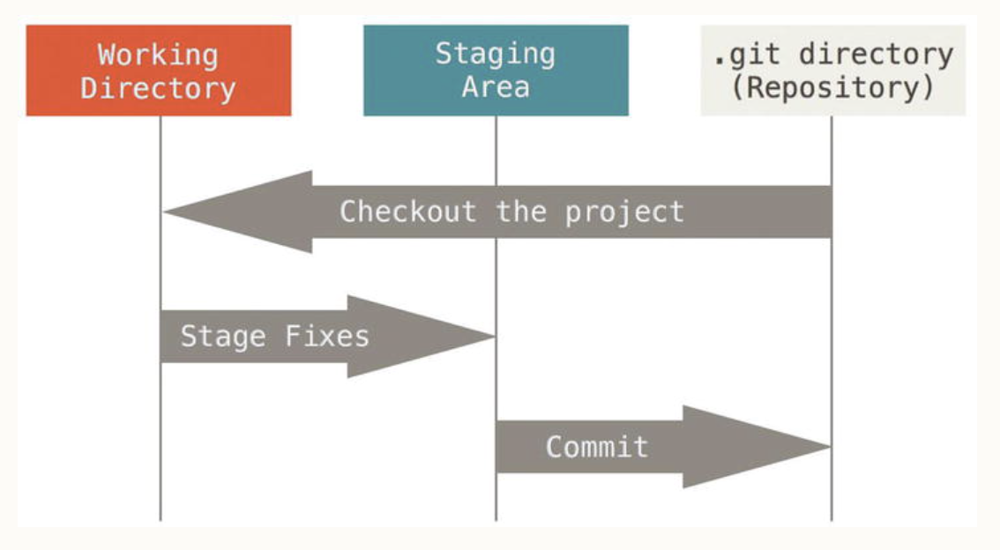

Reference: https://git-scm.com/book/en/v2/

# About Version Control
## CVS vs DVS
- Version control is a system that records changes to a file or set of files over time so that you can recall specific versions later.
- Version Control Systems
  - Centralized Version Control System (CVS)
  - Distributed Version Control System (DVS)

## Git History
- Linux Kernel VCS
  - 1991-2002: Patches and archived files
  - 2002-2005: BitKeeper (BitKeeper is a DVCS)
  - 2005: Git
    - Speed
    - Simple Design
    - Non-linear Development
    - Fully Distributed
    - Handle Large Projects

## Git Basics
- Snapshots, not differences
- Nearly Every Operation Is Local
- Git Has Integrity
  - The mechanism that Git uses for this checksumming is called a SHA-1 hash.
  - Git stores everything in its database not by filename but by the hash value of its contents.
- Git Generally Only Adds Data
- The Three States
  - Git has three main states that your files can reside in: committed, modified, and staged.

The basic Git workflow goes something like this:
- You modify files in your working directory.
- You stage the files, adding snapshots of them to your staging area.
- You do a commit, which takes the files as they are in the staging area and stores that snapshot permanently to your Git directory.
