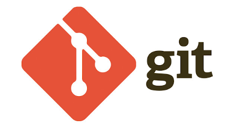

# Git

<!-- Logo image -->

[Pytopia](https://www.pytopia.ai) Git Course Material. Including:

- Git Basics
- Git Branching
- Git on the Server
- Distributed Git
- GitHub
- Git Tools
- Customizing Git

We follow **Git Pro textbook by Scott Chacon and Ben Straub** which is available at [here](https://git-scm.com/book/en/v2).

To register for the course, visit the [Pytopia Website](https://www.pytopia.ai/).

## Table of Contents

- Git basics
    - Introduction to Git and version control systems
         - What is Git?
              - What is version control systems? 
              - Why do we need version control systems?
    - Installing Git
         - Installing Git on Windows
         - Installing Git on Mac
         - Installing Git on Linux
    - Git vs GitHub
         - What is GitHub?
         - What is Git?
         - What is the difference between Git and GitHub?
         - Github Alternatives
    - Setup VsCode as git editor
    - First time Git setup
         - Configuring gloabl user information
         - Configuring local user information
            - Configuring default editor and diff tool
        - Git help
- Working with Git repositories 
    - Defining Staging Area, Working Directory and Repository
    - Using Git status
    - Creating a new repository using git init
    - Cloning an existing repository
- Git basics
    - Git add
    - Git commit
    - Git log
    - Git diff
    - Git reset
    - Git checkout
    - Git rm
    - Git mv
    - Git clean
    - Git stash
    - Git ignore
    - License and Readme files in Git
    
    
     
